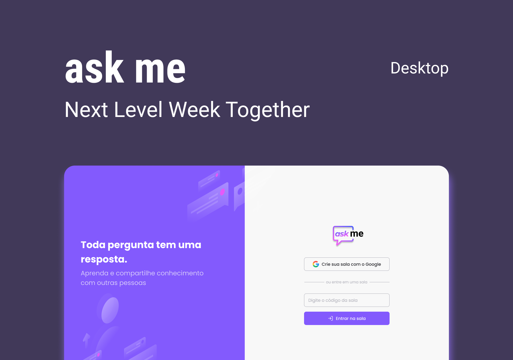

  <h1>ask_me</h1>
  

## Descrição

O usuário pode criar uma sala de perguntas realizando autenticação com sua conta Google, após isso ele pode compartilhar o código gerado para que outras pessoas possam acessar a sala e criar perguntas e dar like nas perguntas que mais gostarem.

O criador da sala tem acesso a uma visão de administrador em que pode destacar, marcar perguntas como respondidas ou deletar perguntas da sala.

### [Live Demo](https://ask-me-4967d.web.app)

## Tecnologias

- [React](https://pt-br.reactjs.org)
- [Typescript](https://www.typescriptlang.org)
- [Firebase](https://firebase.google.com)
- [Sass](https://sass-lang.com)

## Layout

[Figma Layout](https://www.figma.com/file/u0BQK8rCf2KgzcukdRRCWh/Letmeask/duplicate)

## Créditos

Idealizado e desenvolvido no evento do NLW Together pela [Rocketseat](https://rocketseat.com.br) 💜🚀
